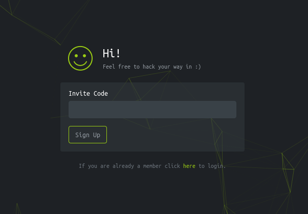
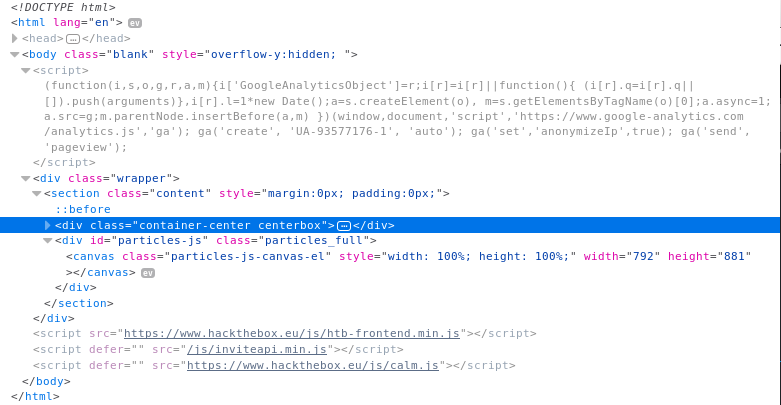

# Hack The Box
## Invite Code

### Introduction
[Hack the box](www.hackthebox.eu) is a fun site for practice pen-testing. One feature is that although it is totally free (of coz you can spend money for more "box"), but there are no "registration portal" for an account. Instead, you have to **hack** the invite code to get yourself an account.

### Steps
1. Go to [www.hackthebox.eu](www.hackthebox.eu/invite), and through the button you will find a portal for invite code.
    
1. There are not much content on the site, no place to poke around with. Let's open firebug to see the content.
    
1. After searching, there is a "/js/inviteapi.min.js" comes with the site seems to be related to the invite code.

    ```js
    eval(function(p,a,c,k,e,d){e=function(c){return c.toString(36)};if(!''.replace(/^/,String)){while(c--){d[c.toString(a)]=k[c]||c.toString(a)}k=[function(e){return d[e]}];e=function(){return'\\w+'};c=1};while(c--){if(k[c]){p=p.replace(new RegExp('\\b'+e(c)+'\\b','g'),k[c])}}return p}('1 i(4){h 8={"4":4};$.9({a:"7",5:"6",g:8,b:\'/d/e/n\',c:1(0){3.2(0)},f:1(0){3.2(0)}})}1
j(){$.9({a:"7",5:"6",b:\'/d/e/k/l/m\',c:1(0){3.2(0)},f:1(0){3.2(0)}})}',24,24,'response|function|log|console|code|dataType|json|POST|formData|ajax|type|url|success|api|invite|error|data|var|verifyInviteCode|makeInviteCode|how|to|generate|verify'.split('|'),0,{}))
    ```

1. As the code is in .min.js, it is very ugly code to be read. so lets beautify it

    ```js
    function verifyInviteCode(code) {
      var formData = {
        "code": code
      };
      $.ajax({
        type: "POST",
        dataType: "json",
        data: formData,
        url: '/api/invite/verify',
        success: function(response) {
          console.log(response)
        },
        error: function(response) {
          console.log(response)
        }
      })
    }

    function makeInviteCode() {
      $.ajax({
        type: "POST",
        dataType: "json",
        url: '/api/invite/how/to/generate',
        success: function(response) {
          console.log(response)
        },
        error: function(response) {
          console.log(response)
        }
      })
    }
    ```

1. that is much better. we can see there are two function and it is waiting for us to call! and we'll receieve the following when we make makeInviteCode() in console:

    > data: "SW4gb3JkZXIgdG8gZ2VuZXJhdGUgdGhlIGludml0ZSBjb2RlLCBtYWtlIGEgUE9TVCByZXF1ZXN0IHRvIC9hcGkvaW52aXRlL2dlbmVyYXRl"
    > enctype: "BASE64"

1. How good they are to be also givin us the encryption method! Although we can judge it by the appearence of [A-Z,a-z,0-9].After Decode:

    > In order to generate the invite code, make a POST request to /api/invite/generate

1. Okay, I was thinking that you could give me code directly, but lets modify the ajax in function and make the call again:

    ```js
    function makeInviteCode() {
      $.ajax({
        type: "POST",
        dataType: "json",
        url: '/api/invite/generate',
        success: function(response) {
          console.log(response)
        },
        error: function(response) {
          console.log(response)
        }
      })
    }
    ```

    > code: "TEtURUMtSUFYSlEtWVVMV0ItUlRQUVktTFNHUEU="
    > format: "encoded"

1. Okay now that is a cipher text we have to figure out the encoding scheme. One more time, judging by the [A-Z,a-z,0-9] and the [=] padding, we can once again tell it is a Base64 encode.

    > LKTEC-IAXJQ-YULWB-RTPQY-LSGPE

1. Now there is our registration panel! Have Fun Hacking!
