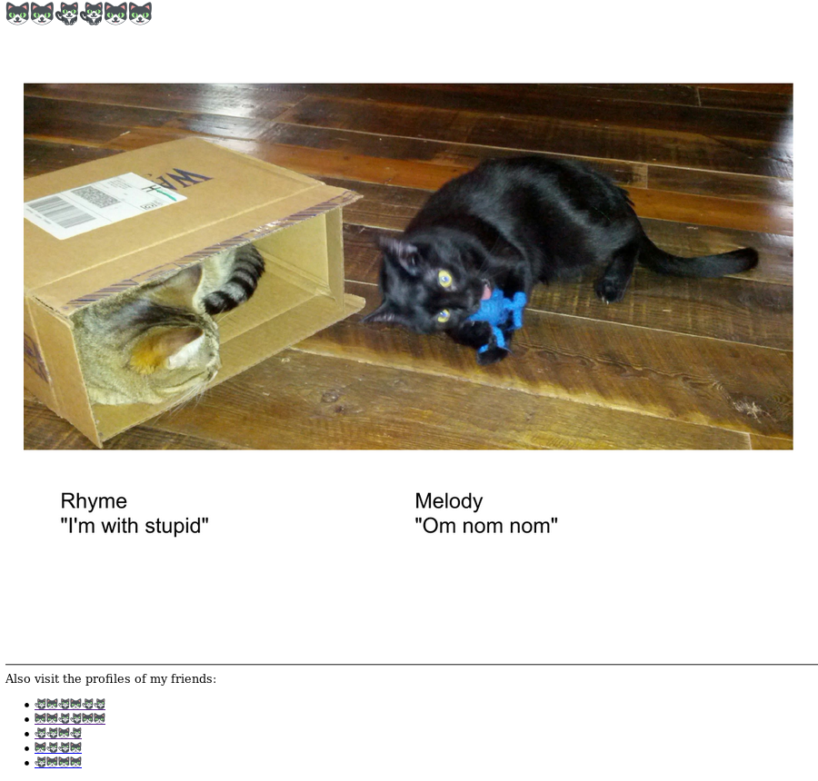
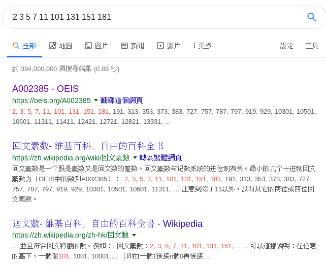

# GoogleCTF
## 2019 - Beginner Quest (Part 2)
[lint to Part 1](./GoogleCTF_Beginner_Quest.html)

### Day 2 - Work Computer (sandbox)
#### Steps
1. This time we are to explore the work computer of our subject. This time we have no attachment except a network address:
    > readme.ctfcompetition.com 1337
1. After netcat, it brings us to a shell, but we cannot access the README.flag
    ```console
    > ls -l
    total 8
    ----------    1 1338     1338            33 Jun 30 03:43 ORME.flag
    -r--------    1 1338     1338            28 Jun 30 03:43 README.flag
    > cat README.flag
    error: No such file or directory
    > pwd
    /challenge
    ```
1. The error given from cat tells us that the utility 'cat' itself does not exist on the environment that we are using. so we have to use otherways to view the file. I tried 'more', 'less', 'vi', 'nano', 'awk' and all did not work. Running out of resources, I have to go to see what program I can use. Luckily we can access '/bin', where all binarys are stored, so as all functions we can use:
    ```console
    > cd /bin
    > ls -la
    total 808
    drwxr-xr-x    2 65534    65534         4096 Jun 13 14:28 .
    drwxr-xr-x   20 0        0             4096 Jun 13 14:28 ..
    lrwxrwxrwx    1 65534    65534           12 May  9 20:49 arch -> /bin/busybox
    ...
    ```
1. There are like 40-50 of them, which mostly I havent heard of. Common file viewer cannot be found, so I have to check its useage one by one. This takes a long time and the solution I can find is `tar`, which will default print the archieve out when it creates one:
    ```console
    > cd /challenge
    > tar -c README.flag
    README.flag0000400000247200024720000000003413506031137010412 0ustar  13381338CTF{XXXXXXXXXXXXXXXX}
    > 
    ```
1. Here is our flag. Not too hard, but certainlly time consuming.


### Day 5 - FriendSpaceBookPlusAllAccessRedPremium
#### Steps
1. This day we were given two files - a python script and a SysEx file. The python script can be used to read the SysEx flie, SLOWLY.
    ```console
    $ python3.6 vm.py program
    Running ....
    http://emoji-t0anaxnr3nacpt4na.web.ctfco^C
    ```
1. The decoding speed goes down gradually, but I must wait it as it is an URL. the above decoding takes me ~3hrs to load. Once I figure out that it is the site that we uses in previous task, `http://emoji-t0anaxnr3nacpt4na.web.ctfcompetition.com/` , I terminated it without a doubt. The site is a gallary of cats. There are 3-5 links each page and all of them are cats.
     
1. After enumerating all sites, I decided that there are no insight in the site(another time consuming task). Then I have to get back to the two files on our hand. This is where I find the `program` file given is a file full of emoji. Combining the python script we could generate it back to the origional assembly file. Utilizing the function given, I can write a python script to decrypt the file:
    ```python
    # - *- coding: utf- 8 - *-
    import sys
    OPERATIONS = {
      '🍡': 'add',
      '🤡': 'clone',
      '📐': 'divide',
      '😲': 'if_zero',
      '😄': 'if_not_zero',
      '🏀': 'jump_to',
      '🚛': 'load',
      '📬': 'modulo',
      '⭐': 'multiply',
      '🍿': 'pop',
      '📤': 'pop_out',
      '🎤': 'print_top',
      '📥': 'push',
      '🔪': 'sub',
      '🌓': 'xor',
      '⛰': 'jump_top',
      '⌛': 'exit'
    }
    if __name__ == '__main__':
      if len(sys.argv) != 2:
        print('Missing program')
        raise SystemExit()
      with open(sys.argv[1], 'r') as f:
        print('Running ....')
        all_ins = ['']
        all_ins.extend(f.read().split())
        for a in all_ins:
            b = OPERATIONS.get(a, None)
            if a == '🖋':
                print('\n' + a + '\n')
            if b is None:
                print(a , end = ' ')
            else:
                print("\n" + b + " ", end = ' ')
   ```
1. After decoding, we can see the assembly, with functions represented by '🖋':
   ```console
   Running ....
   load  🥇 0️⃣ ✋
   push  🥇
   load  🥇 1️⃣ 7️⃣ 4️⃣ 8️⃣ 8️⃣ ✋
   ...
   🖋💠🔶🎌🚩🏁
   pop  🥇
   push  🥈
   push  🥇
   ...
   ```
1. This is not very good indeed, but we can try to trace the program mechanism. it trys to print characters with the XOR product of the numbers in the stack and a number generated:
   > 1st round: 106 XOR 2 --> h    
   > 2nd round: 119 XOR 3 --> t    
   > 3rd round: 113 XOR 5 --> t    
   > 4th round: 119 XOR 7 --> p    
   > 5th round: 49 XOR 11 --> :    
   > ...    
1. and the number generated has escalate and soon it takes half hour to compute the XOR as the number grows quickly. Stuck here, it is easy to reconize that the number generated is always prime number, and by luck it can be searched in google:
     
1. The sequence is called [`Palindromic primes`](oeis.org/A002385). Knowing this, we can pre-calcualte them and XOR them to print the message.(By the length of the stack we can know there are 86 characters to print, which is the 1-40 prime, 99-112 prime, 765-796 prime). Then we can calculate prime by brute force to build a map and plug the number in. Remember to check for palindrom first before checking prime, as check prime takes much more time.
    ```python
    def is_prime(n):
      f = 2
      while f**2 <= n:
        if n%f == 0:
          return False
        f += 1
      return True
    if __name__ == '__main__':
      p = [2,3]
      x = 3
      for i in range(3, 798):
        while 1:
          if(str(x)==str(x)[::-1]):
            if is_prime(x):
              break
            x += 2
          else:
            x += 2
        x += 2
        p.append(x-2)
        print(str(p[-1]) + '  ' + str(i))
      print(p)
      # print(len(p))
      l1 = [106,119,113,119,49,74,172,242,216,208,339,264,344,267,743,660,893,892,1007,975,10319,10550,10503,11342,11504,12533,12741,12833,13437,13926,13893,14450,14832,15417,15505,16094,16285,16599,16758,17488]
      l2 = [93766,93969,94440,94669,94952,94865,95934,96354,96443,96815,97280,97604,97850,98426]
      l3 = [9916239,9918082,9919154,9921394,9923213,9926376,9927388,9931494,9932289,9935427,9938304,9957564,9965794,9978842,9980815,9981858,9989997,100030045,100049982,100059926,100111100,100131019,100160922,100404094,100656111,100707036,100767085,100887990,100998966,101030055,101060206,101141058]
      # print(len(l1))
      # print(len(l2))
      # print(len(l3))
      i = 1
      for a in l1:
        print(chr(a^p[i]), end='')
        i += 1
      i = 99
      for a in l2:
        print(chr(a^p[i]), end='')
        i += 1
      i = 765
      for a in l3:
        print(chr(a^p[i]), end='')
        i += 1
    ```
1. After that we can retrieve the url.....with a folder:
    > http://emoji-t0anaxnr3nacpt4na.web.ctfcompetition.com/humans_and_cauliflowers_network/
1. And there we find our flag after a little browsing!


### Day 6 - Drive to the target
#### Steps
1. This category is involved in coding as the category suggest. We have only a website given, which receieve two input boxes, and submitting the form gets us different responses:
    > If you want to meet your friends, you should move.
    > You went XXm at a speed of YYkm/h. You are getting away…
    > You went XXm at a speed of YYkm/h. You are getting closer…
    > Woa, were about to move at XXXkm/h, this is too fast!
1. If the input goes too much, we receieves 'too fast' error and the value is reverted. Therefore we have to do this bit by bit, 0.0001 by 0.0001. it is clear where the coding should goes:
    ```javascript
    var lat = 51.6497;
    var lon = 0.0982;
    var token = "XXXXXXXX";
    var count = 0;
    var flag = 0;
    var flag2 = 0;
    var a,b,c,d,e,f;

    setInterval(function(){
      var xhttp = new XMLHttpRequest();
      xhttp.onreadystatechange = function() {
          if (this.readyState == 4 && this.status == 200) {
              a = xhttp.responseText;
              b = a.split('<p>');
              c = b[2].split('</p>');
              console.log(c[0]);
              d = a.split('token');
              e = d[1].split('">');
              f = e[0].split('value=\"');
              token = f[1];
              count++;
              console.log(lat + '   ' + lon + '    ' + count);
              if(c[0].indexOf('away') != -1){flag = 1;}
          }
      };
      site = "https://drivetothetarget.web.ctfcompetition.com/?lat="+lat+"&lon="+lon+"&token="+token;
      console.log(site);
      xhttp.open("GET", site, false);
      xhttp.send();
      if(flag == 0 && flag2 == 0){
        lat = (lat - 0.0001).toFixed(4);
      }else if(flag == 1 && flag2 == 0){
        flag2 = 1;
        lat = (lat + 0.0001).toFixed(4);
      }else{
        lon = (lon - 0.0001).toFixed(4);
      }
    }, 1000);
   ```
1. After some time(as the request has to send 1request/sec otherwise will be too fast), we can find the place where 'closer' becomes 'away'. In my case it is lat-`51.4924` and lon-`-0.1929`. But that is not the flag sadly, but very close. After some twisting of steps, the value pair was found --- lat `51.4921` and lon `-0.1929`:
    > Congratulations, you made it, here is the flag: CTF{XXXXXXXXXXXXX}

